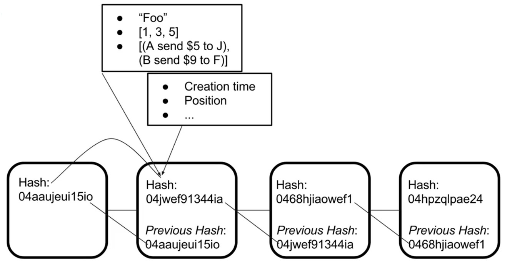
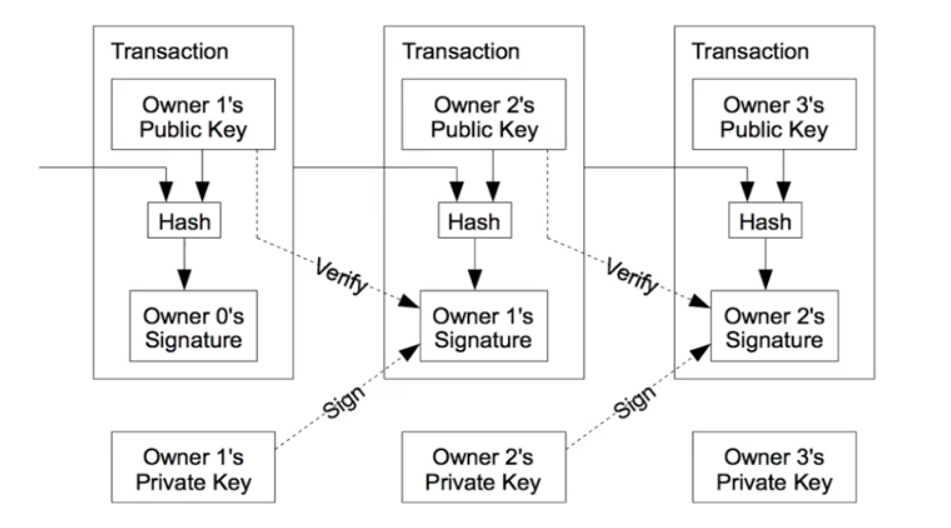

# **Simple Blockchain and a cryptocurrency**

## **Issues:**
- Code the core blockchain
- Build an API around the blockchain
- Create a dynamic peer-to-peer server multiple contributors
- Implement a proof-of-word system to balance users
- Create a transaction system for cryptocurrency 

## **Steps:**
1. Build the Blocks
2. Build the Chain
3. Develop the Blockchain Application (web API in expressJS, Postman as a web client)
4. Create the Blockchain Network (using web socket)
5. Proof of Work
6. Wallets and Transactions on the Blockchain
7. Collect Transactions in a Pool
8. Mine Transactions in a Block

## **Blockchian**
The blockchain is a distributed and desentralized ledger that stores data such as transactions, and that is publicly shared across all the nodes of its network .

## **Ledger**
A ledger is a record-keeping book that stores all the transactions of an organization. 

## **Why use the blockchain?**
- Decentralization leads to a trustless system. (no need to trust to a central manager)
- No middle men and no fees.
- Highly secure and no central point of failure
- Dependable data

## **Cryptocurrency**
- A cryptocurrency is a digital medium of exchange
- It hast three main features:
  - **a secure blockchain:** use cryptography(public/privare key pair) to generate digital signitures
  - **wallets:** Objects that store the private and public keys of an individual. (public key is the address of wallet) 
  - **mining:**
    - Transactions are temporarily "unconfirmed"
    - Include blocks of transactions by solving a "proof of work" algorithm
      - Difficult to solve, and computationally expensive
      - Once solved, the miner can add the block and other miners will verify
      - Miners are rewarded for adding a block to the chain
      - The difficulty can adjust to control the rate of new blocks coming in

## **Components**
- ### **Web API application (endpoints)**
  - blocks
  - mine
  - transactions
  - transact
  - public-key
  - mine-transactions
- ### **Block**
  - timestamp
  - lastHash
  - hash
  - The data to store
- ### **Blockchain**
  - chain
  - addBlock()
  - isValidChain()
  - replaceChain()
- ### **Wallet**
  - balance
  - keyPair
  - publicKey
  - sign()
- ### **Transaction**
  - id
  - input
  - output
  - create()
  - update()
  - verify()
- ### **Transaction Pool**
  - transactions
  - updateOrAddTransaction()
  - validTransactions()
  - clear()
- ### **Miner**
  - blockchain
  - transactionPool
  - wallet
  - p2pServer
  - mine()
- ### **Peer-to-Peer server**
  - blockchain
  - transactionPool
  - sockets
  - listen()
  - connectToPeers()
  - connectSocket()
  - HandleMessage()
  - sendChain()
  - syncChains()
  - sendTransaction()
  - broadcastTransaction()

  
 
 
## **How to run the application**
- **$npm run test** Apply all unit tests 
- **$npm run dev-test** Run development tests written in dev-test.js
- **$npm start** Start Blockchain and its web API 
- **$npm run dev** Start Blockchain and its web API for development assessments, you can now use Postman tool to work with Blockchain 

- web API interface 
  - default HTTP_PORT is 3001
  - GET  http://localhost:3001/blocks : express Blockchain blocks
  - POST http://localhost:3001/mine :   mine new block(pass block data as http post json data)
  - GET  http://localhost:3001/transactions : express Blockchain transactions
  - GET  http://localhost:3001/transact : perform Blockchain transaction
  - GET  http://localhost:3001/public-key : get wallet address
  - GET  http://localhost:3001/mine-transactions : complete Blockchain transactions by miner

- to run first server
  - $npm run dev
- to run other sample servers
  - $HTTP_PORT=3002 P2P_PORT=5002 PEERS=ws://localhost:5001 npm run dev

